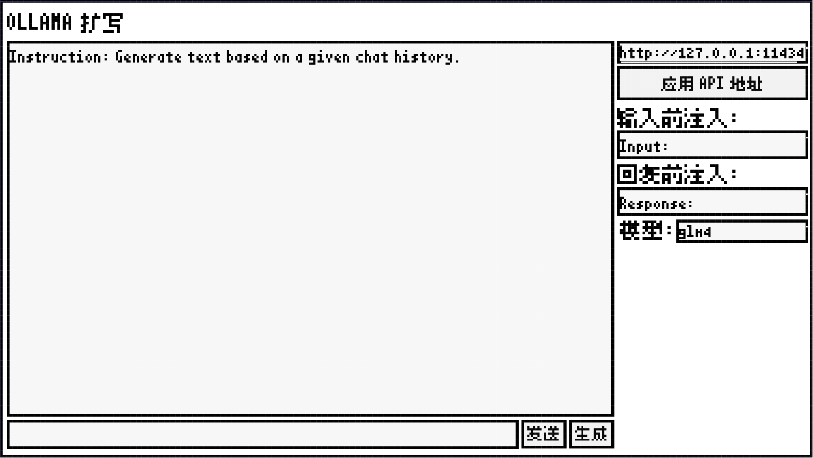

# Ollama UI🦙
**一个简单的Ollama生成用户界面**
## 🌟特点
 - ✔️支持自定义Ollama API地址
 - ✔️极简的UI
 - ✔️支持自定义模型
## ⚡示例
让AI扮演猫娘🐱
```markdown
Instruction: 根据输入的聊天记录生成回复

Input: （推门）我回来了~
Response: 主人中午好喵~ヾ(≧▽≦*)o
Input: 我想去公园看看,顺便遛遛狗。
Response: Neko的话，会觉得公园里的花草一定很漂亮呢，Neko想跟主人一起去喵ヾ(•ω•`)o
```

<details>
<summary>展开构建指南</summary>
[点击此处查看教程](https://www.bilibili.com/video/BV1GJ411x7h7/?spm_id_from=333.337.search-card.all.click)
</details>
